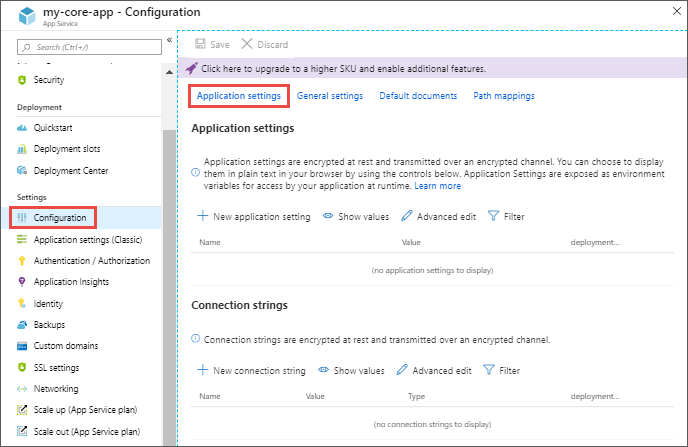

  &nbsp; Azure Cosmos DB Live Container Migration for .NET Core
==========================================

The Azure Cosmos DB Live Container Migration tool for .NET Core migrates documents from a Monitored Container to a Target Container in real-time. The tool copies data to the Target Container as It comes in the Monitored Container using [Azure Cosmos DB ChangeFeed](https://docs.microsoft.com/en-us/azure/cosmos-db/change-feed). The tool also leverages [Azure Cosmos DB Bulk Executor Library](https://docs.microsoft.com/azure/cosmos-db/bulk-executor-overview)
to achieve a high write throughput in case of huge data migration scenarios and [Azure Functions](https://azure.microsoft.com/services/functions/) for deployment. The tool migrates data since the beginning of time with respect to the Monitored container. As a result, the Target Container is guaranted to have all the documents that are in the Monitored container once migration is done barring any erros.

## Table of Contents

  - [Consuming the Microsoft Azure Cosmos DB BulkExecutor .NET library](#Consuming-the-Microsoft-Azure-Cosmos-DB-BulkExecutor-NET-library)
    - [Configuring Migration Parameters](#Configuring-Migration-Parameters)
    - [Configurable settings](#Configurable-settings)
    - [Hosting platform instanse configuration](#Hosting-platform-instanse-configuration)
    - [Deploying MigrationExecutorApp](#Deploying-MigrationExecutorApp)
  - [Performance of Cosmos DB Live Migration Tool](#Performance-of-Cosmos-DB-Live-Migration-Tool)
  - [Monitoring the Migration Progress](#Monitoring-the-Migration-Progress)

## Consuming Azure Cosmos DB .NET Core Live Migration Tool

This repository includes a [project that executes the migration](Src/MigrationExecutorFunctionApp/MigrationExecutorFunctionApp.csproj), a [project that tracks the progress](MigrationProgressTrackingApp/MigrationProgressTrackingApp/MigrationProgressTrackingApp.csproj) and the throughput of the migration process, and a [test project](Src/MigrationExecutorUnitTests/MigrationExecutorUnitTests.csproj ).
To get started with migration, make sure you have the Target Container created. We don't check if the Monitored or Target container exists, so a wrong container id would lead to an 
undefined behavior.

To get started, clone the repository. In the meantime, make sure you have an Azure Function Instance created with an App Service Plan hosting plan.
The bulk executor that the tool uses to optimize write throughput leverages concurrent writing within a partition key range so a machine with more than one core is 
required. Since, Consumption hosting plan does not scale up, we require customers to deploy this tool in a Azure Function Instance in App Service Plan hosting plan.

For a better migration performace, make sure your Azure Function Instance is as close to your Target and Monitored containers regions as possible. 

### Configuring Migration Parameters

Once you  have created an Azure Function Instance, head to the *Configuration* option to configure migration settings. Migration settings include connection strings to your monitored and target containers,
monitored container's id and database, target container's id and database, and storage queue name and connection string, **which has to be created before deploying the migration app and starting the Azure Function Instance**. A storage queue is used as a post-mortem storage service in case a document write fails.
The migration settings are exposed as environment variables and accessed by the migration application during runtime. You can learn more about Azure Function Instance configuration [here](https://docs.microsoft.com/azure/app-service/configure-common).

&nbsp;

&nbsp;

### Configurable settings

* *SourceCosmosDB* : The connection string to your Cosmos DB Database account that contains your Monitored Container that you would like to migrate
* *SourceDatabase* : The name of the database that contains your Monitored Container.
* *SourceCollection* : The name of your Monitored Container.
* 
* *EndPoint* : The endpoint to your Azure Cosmos DB Database account that contains your *Target Container*.
* *AuthKey* : The key to your Azure Cosmos DB Database account that contains your *Target Container*
* 
* *TargetCosmosDB* : The connection string to your Cosmos DB Database account that contains your Target Container that you would like to migrate
* *TargetDatabase* : The name of the database that contains your Target Container.
* *TargetCollection* : The name of your Target Container.
* 
* *QueueName* : The name of the storage queue.
* *QueueConnectionString* : The connection string to the storage queue.

We have two variables for connection strings just in case a user has the Target Container in a different Cosmos DB account than the Monitored Container. If a user has
both Containers under the same Cosmos DB account, then *SourceCosmosDB* and *TargetCosmosDB* are going to have the same value.

After navigating to the Application Settings blade, click **New Application Settings** and add each of the above configurable settings with their appropriate values

&nbsp;

&nbsp;

After adding every configurable setting with the right value, your Application Settings blade should be very similar to the image below
&nbsp;

&nbsp;
### Hosting platform instance configuration

This Azure Cosmos DB Live Migration tool uses Azure Cosmos DB BulkExecutor library. According to Azure Cosmos DB BulkExecutor library documentation, "when a bulk import API is triggered with a batch of documents[to be migrated], on the client-side[in the Azure Function Environment in this case], they are first shuffled into buckets corresponding to their target Cosmos DB partition key range. Within each partiton key range bucket, they are broken down into mini-batches and each mini-batch of documents acts as a payload that is committed transactionally.
We have built in optimizations for the concurrent execution of these mini-batches both within and across partition key ranges to maximally utilize the allocated collection throughput." Since this migration tool leverages Azure Cosmos DB BulkExecutor concurrent execution of documents mini-batches for a better migration performance, it is important this tool is deployed in an environment with more than one core.

In order to scale up and allow the tool to perform optimally, navigate to your Azure Function App Instance and click **Platform features** > **Scale Up**
&nbsp;

&nbsp;

Availability of computing resources impact the speed of migration. For most common scenarios, we recommend you to choose **S3 400 ACU** pricing tier. For more information about other pricing tiers and how they satisfty various performance needs, click [here](https://docs.microsoft.com/azure/virtual-machines/windows/acu).

&nbsp;

&nbsp;
Once you have configured Migration Application settings and the hosting platform, you can publish the MigrationExecutorApp from the cloned repository in the Azure Function Instance. If you don't want the migration to start right away, you can stop the Azure Function Instance, deploy the code from visual studio, and start the Azure Function Instance whenever you want.

### Deploying MigrationExecutorApp

If you have [Visual Studio 2019](https://visualstudio.microsoft.com/downloads/) and have cloned the repository, deploying the MigrationExecutorApp should be easy and straight forward.
Right click on the **MigrationExecutorApp** project, then click on **Publish**. 

The rest of the steps should be straight forward and very intuitive since you have already created an Azure Function Instance that lives within some
specified Resource Group.

&nbsp;

&nbsp;

Once all of these is done, make sure to start your function app when you are ready to start migration.

## Performance of Cosmos DB Live Migration Tool

The tool is run on Azure Function Instance in S3 400 ACU 7 GB memory pricing tier in Central US region, migrating data from a Monitored Container in Central US to a Target Container in Central US with 30K RU/s.

One important thing to point out is that as you might have guessed, the RU/s you provision on the Target Container influences how fast the tool can write ceteris paribus, whereas the RU/s provisioned on the 
monitored container influences how fast the tool can read the Monitored Container's changefeed. 

We observe the following performance for the migration of 6.09 million (~1KB) documents from the 400 RU/s **three uneven partitions** Monitored Container into a 30K RU/s Cosmos DB Target Container. The Monitored Container has a different partition key than the Target Container:

| | Time taken (min) | Average Writes/second |
| --- | --- | --- |
|  Performance | 28.5 | 3502 |

We observe the following performance for the migration of 6.09 million (~1KB) documents from the 400 RU/s **three uneven partitions** Monitored Container into a 30 K RU/s Cosmos DB Target Container. The Monitored container has the same partition key as the Target Container:

|               | Time taken (min)  | Average Writes/second |
| -----------   | ----------------  | --------------------  |
| Performance   | 42                | ~ 2400                |

We also observe the following performance for the migration of 2.72 million (~1KB) documents from a 400 RU/s **one partition** Monitored Container into a 30 K RU/s Cosmos DB Target Container. The Monitored container has a different partition key than the Target Container:

| | Time taken (min) | Average Writes/second |
| --- | --- | --- |
|  Performance | ~ 25 | ~ 1780 |

The tool works better when data is evenly distributed across partitions because there are no threads creating a bottleneck, still writing from their heavier payloads while other threads are just sitting around doing nothing because their mini-batches are not as heavy. We also see a better performance when a Monitored  Container has a different partition key than a Target Container since the Bulk Executor library can read a one partition key range batch from the change feed but write it to several partitions in the Target Container concurrently.
The number of partition key ranges is also another variable that affects the performance of the migration tool. In case of huge amounts of data to be migrated, MigrationExecutorApp instances will be increased to as many as the number of partitions in the Monitored Container. The increased performance results from the fact that the instances can execute in parallel.

We understand that customers have no control over the Partiton Key Ranges once a container is created, but we mention the distribution of data across partitions and the number of Partition Key Ranges and how that affects the performance of the solution to give users more performace context.

## Monitoring the Progress of Migration

The repository contains a console app project that can be used to monitor the progress of migration. The application displays several metrics such as the average documents write per second, current number of documents in the Monitored and Target Containers, ETA, and etc. To consume it, head to the AppSettings.json file within the project and fill out all the migration settings like you did when you configured the 
Azure Function Instance. Once that is done, you can run the application.

## Contributing

This project welcomes contributions and suggestions.  Most contributions require you to agree to a
Contributor License Agreement (CLA) declaring that you have the right to, and actually do, grant us
the rights to use your contribution. For details, visit https://cla.opensource.microsoft.com.

When you submit a pull request, a CLA bot will automatically determine whether you need to provide
a CLA and decorate the PR appropriately (e.g., status check, comment). Simply follow the instructions
provided by the bot. You will only need to do this once across all repos using our CLA.

This project has adopted the [Microsoft Open Source Code of Conduct](https://opensource.microsoft.com/codeofconduct/).
For more information see the [Code of Conduct FAQ](https://opensource.microsoft.com/codeofconduct/faq/) or
contact [opencode@microsoft.com](mailto:opencode@microsoft.com) with any additional questions or comments.
